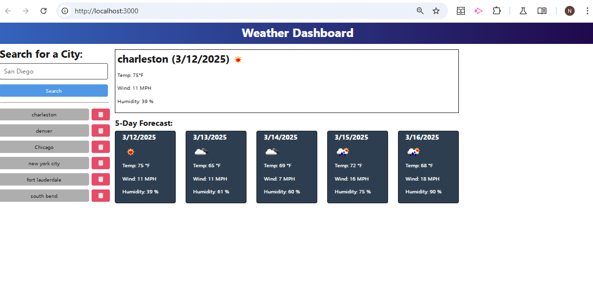
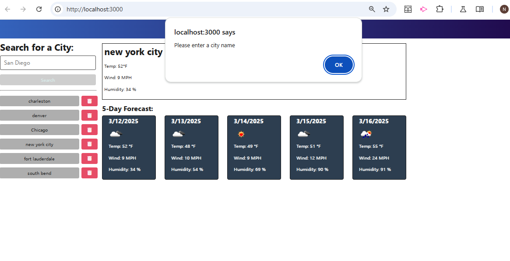
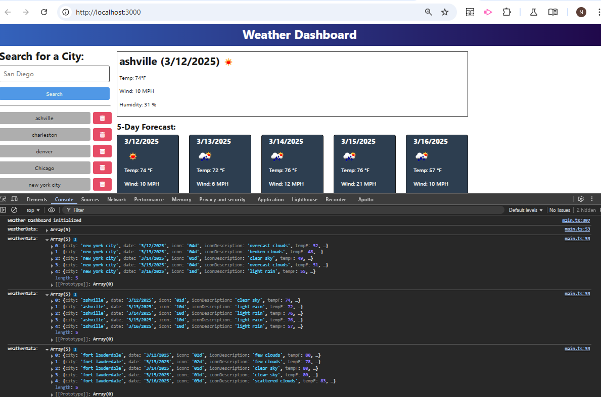

# Open Weather-Dashboard 


## Website Links: 
- [GitHub-Link](https://github.com/noIDEA-tech/weather-dashboard)
- [Deployed-Link](https://ADD.LINK)

## Description
This is a weather dashboard application that users can use to pull up 5-day weather forecasts by city by entering the city name in the input field and then clicking the "search" button. This prompt will call the OpenWeather API and display the current weather forecast in the top box in addition to a 5-day weather forecast. Previous city searches are saved for the user to manage by retrieving a previous search or clearing the search history by clicking on the delete icon located next to each city saved in search history.





## Table of Contents
- [Installation](#installation)
- [Usage](#usage)
- [Credits](#credits)
- [License](#license)
- [Features](#features)
- [Tests](#tests)
- [Contact](#contact)

## Installation
```m
From terminal root directory, run the following commands: 
    - npm install
    - cd server && npm install axios && npm run build
    - cd .. npm run start:dev
```
## Usage
In root directory, run the following terminal command to start the server and client browswer: `npm run start:dev`

## Credits:
- Nancy Watreas
- - AI assistance provided by Anthropic's Claude for debugging, and code review and refactoring

## License
MIT

## Features
- View 5-day forecast displaying the date, an icon representation of weather conditions, temperature, wind speed, and humidity
- User search history display allowing users to click on a previously searched city to display updated weather forecast

## Tests
cd server && npm run build cd .. npm run start:dev

## Contact
If there are any questions or concerns, I can be reached at:
##### [github: noIDEA-tech](https://github.com/noIDEA-tech)
##### [email: nwatreas2023@gmail.com](mailto:nwatreas2023@gmail.com)